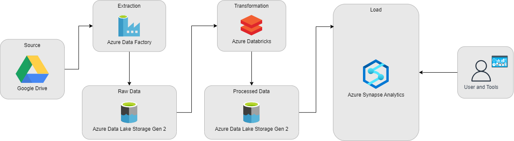
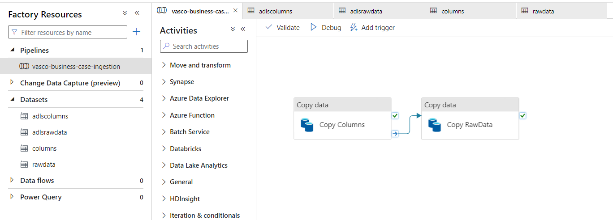
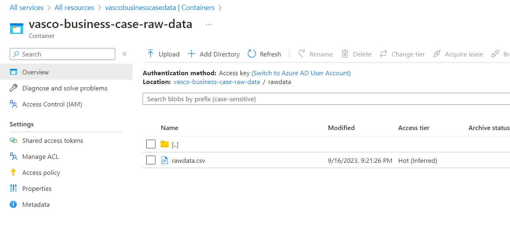
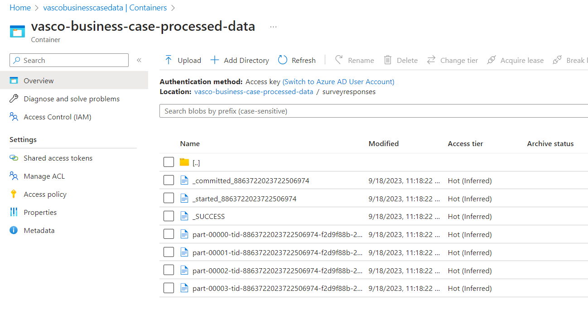
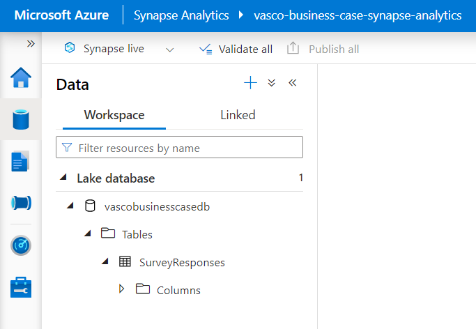
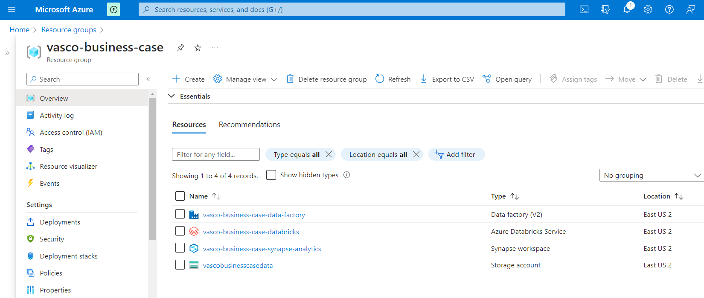
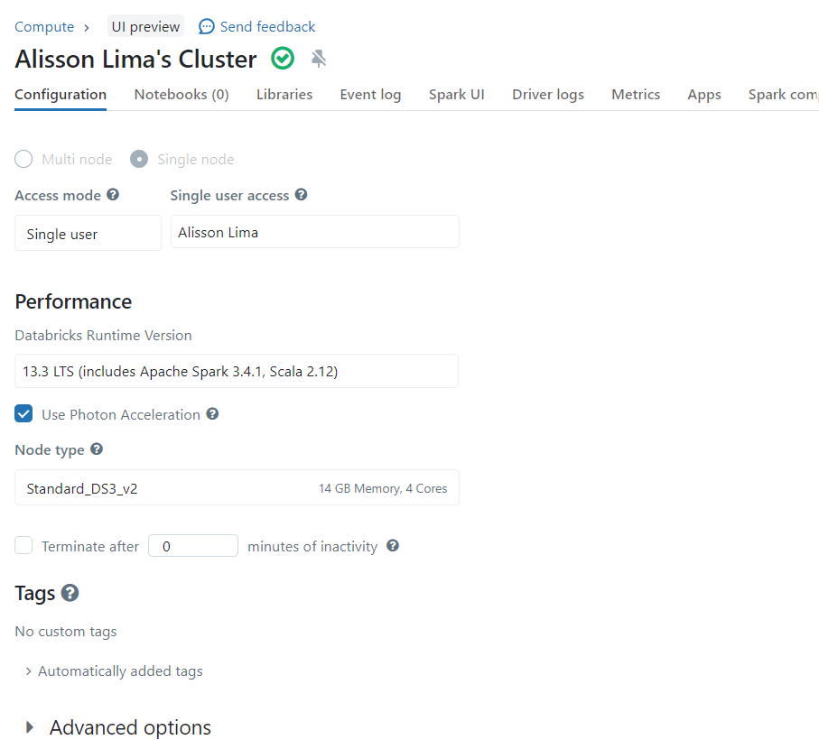

# Data Engineering Survey Data Project Documentation

---

## 1. Objective

The primary objective of this project was to learn the basics of multiple Azure tools by applying them to a practical challenge: managing and analyzing survey data. I chose this path to not only enhance my technical skills but also to gain insights into data structuring, transformation, and analysis in a cloud environment.

### 1.1 Learning focus

The focus on this project was on understanding and using the following Azure services:
- **Azure Data Factory:** For orchestrating the data pipelines.
- **Azure Data Lake Storage:** As a scalable data storage solution.
- **Azure Databricks:** For performing data transformation tasks.
- **Azure Synapse Analytics:** To store and analyze the processed data.

---
## 2. Project Background

A company in the survey business wants to store its data from their own platforms on a more organized
matter, however, there are no data experts to support any implementation, so they hired a Data Engineer 
to support and provide best practices on data engineering.

For the first iteration, they want to start with a simple survey dataset, being: a description of all columns and the raw data, 
both in .csv. They are going to receive this information on a daily basis, once per day. With that said, their main
analysis is understanding which questions have the biggest variance and the relationship between Salary
and Years Coding.

They also need help to design the overall architecture, being, the ETL Pipeline and Final table(s)
schema.

---

## 3. Project Architecture

Here's an overview of the technologies used and how they are integrated into the ecosystem.



**Technologies Used:**

- Python (PySpark)
- Azure Data Factory
- Azure Databricks
- Azure Synapse Analytics
- Azure Data Lake Storage
- Parquet Files

---

## 4. Workflow

### 4.1 Data Collection and Storage

The Azure Data Factory orchestrates the daily ingestion of survey datasets. The Azure Data Factory pipeline, copies data from the sources into the Azure Data Lake Storage container.



### 4.2 Storage in Azure Data Lake

Post-collection, the data is stored in Azure Data Lake Storage, preserving the original format for validation and transformation.



### 4.3 Data Transformation

The ```Vasco Business Case Transformation.ipynb``` file holds the details of the transformation process performed.

The transformation process is performed on Databricks in a Spark cluster.

The collected data undergoes various transformation stages:

- Enforcement of business rules and data integrity checks.
- Conversion to the Parquet format for optimized analytical operations.



### 4.4 Load into Azure Synapse Analytics

The transformed data, stored as .parquet files, is loaded into Azure Synapse Analytics,  making the data ready for analytical operations.



---
## 5. Observations

### 5.1 Format & Schema Choice

The decision to keep a flat table schema was driven by a few primary considerations:
- **Simplicity:** As the company is in the early stages of its data engineering journey, a single table schema is easier to manage and understand.
- **Nature of Data:** Survey data is typically respondent-centric. A flat table efficiently captures individual responses, making it ideal for this dataset.
- **Efficiency:** Modern tools like Azure Synapse Analytics handle flat tables effectively, ensuring good query performance.
- **Minimal Dimensions:** The dataset primarily captures responses with limited attributes, making a more complex schema unnecessary.

### 5.2 Cloud Implementation Scenario

For implementing this solution, I leveraged Azure's suite of services, mainly because I wanted to learn the basics of the Azure ecossystem since I have not 
developed any project in this platform before, but also because of the following considerations:
- **Integration:** Azure services interconnect seamlessly, simplifying data movement and transformation across platforms.
- **Scalability:** Azure provides the ability to scale resources as needed, ensuring that the system can handle the company's growing data needs.
- **Performance:** Tools like Azure Databricks and Synapse Analytics are optimized for fast data processing and analytics, enabling efficient transformations and insights.
- **Security:** Azure's built-in security features ensure that the data remains protected throughout the ETL process.




### 5.3 Final Table Schema

Given the choice to maintain a flat table structure for this dataset, our schema essentially mirrors the structure of the .parquet files. 
We aren't creating a multi-table schema but instead directly replicating the .parquet schema as an external table in Azure Synapse Analytics. 
This approach ensures simplicity and direct correspondence between the processed data and its representation in Synapse Analytics, facilitating straightforward querying and analytics.

---

## 6. Repository Structure and Deployment

The repository contains a "Data" folder with the raw survey data and a Jupyter notebook detailing the transformation logic.

**Repository Contents:**

- **data:** Contains the raw survey data.
- **.ipynb file:** Jupyter notebook with transformation steps.
- **imgs:** Contains images of the project.

To deploy the data pipeline, the Azure environment is configured to work with the provided datasets and scripts.

---

## 7. Final Thoughts

This project has been an invaluable learning experience, providing me with a hands-on approach to understanding Azure's data services. By documenting my process, I hope to not only track my progress but also to assist others who are new to Azure or cloud services in general.
